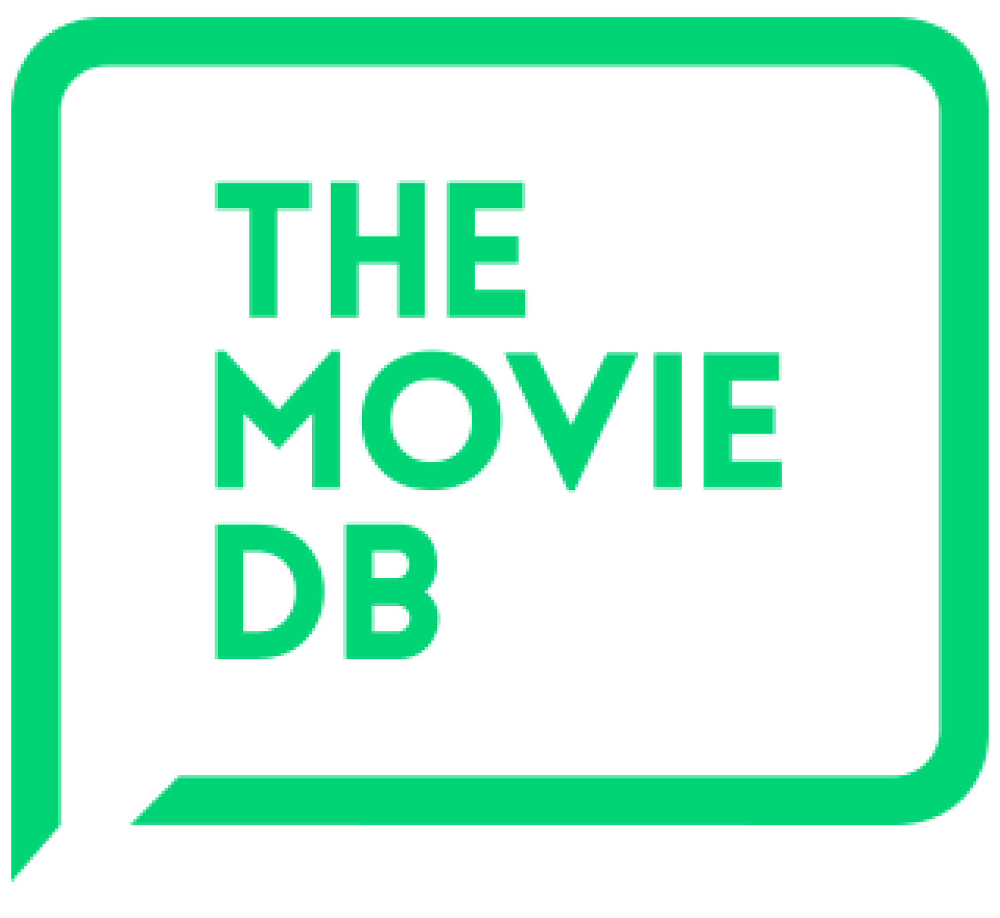

# The Movie Database

### Projeto desenvolvido em ReactJS usando API The Movie Database API :movie_camera:

Lista de filmes desenvolvida em ReactJS usando API The Movie Database API

Link do projeto: https://react-moviedb.vercel.app/

  

## Para começar :arrow_forward:

- Para começar, você pode fazer o download do projeto. Ou clonar o projeto com o seguinte comando:

`git clone https://github.com/MendesFilipe/react-moviedb.git`

- Agora entre na pasta criada pelo git com:

`cd react-moviedb`

- Depois, instale o projeto com o seguinte comando:

`npm install`

## Para desenvolver :minidisc:

Há um servidor de desenvolvimento, uma suite de testes com [jest](https://github.com/facebook/jest) 

- Para inicializar, o comando é:

`npm start`

- Para testar:

`npm test`

## Para compilar :floppy_disk:

Para compilar a aplicação basta seguir os dois passos abaixo:

- Para realizar o build da aplicação:

`npm build`

## Construído com :construction:

- [React](https://reactjs.org/) 
- [Bootstrap](https://www.npmjs.com/package/bootstrap)
- [Axios](https://www.npmjs.com/package/axios)
- [Jest](https://jestjs.io/) 

## Licença :page_with_curl:

Esse projeto possui a licença **MIT**.

